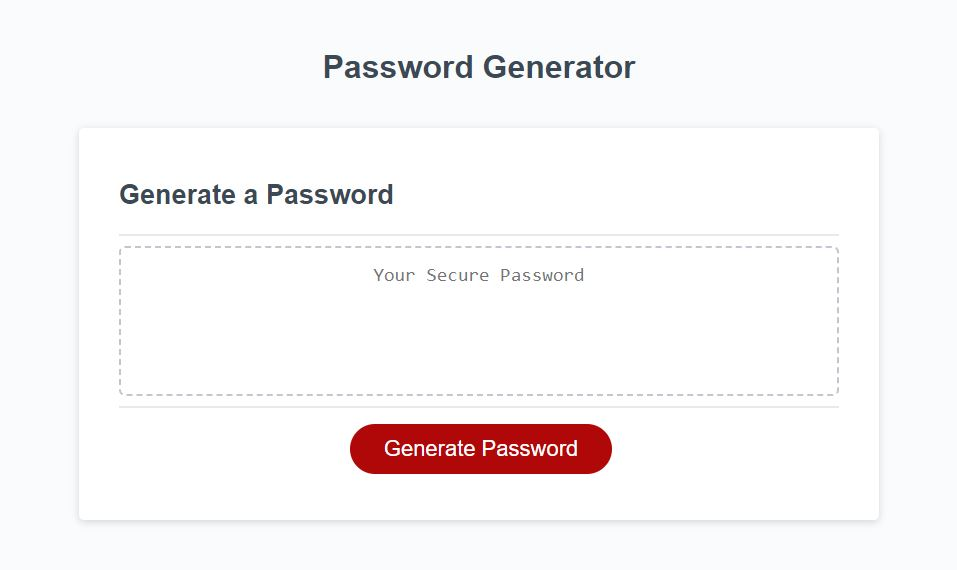

# Secure Password Generator

## Description

This project is a webpage that utilizes JavaScript to generate a unique and secure password. Through a series of prompts you may choose a length between 8 and 128 digits, as well as whether or not you would like to include certain symbols including lower, upper, numeric, and special characters. This project is my first project that required significant JavaScript. Although there are probably many ways I could have written it cleaner, it has helped me to learn more about the language and develop my programming skills.

## Screen Capture of Site

## URL to Site

https://dingbat-weasel.github.io/Secure-Password-Generator/

## Credits

This is an assignment for the UW Full Stack Coding Bootcamp, the starter files as well as the idea for the project were provided by the instructor of the program.

## License

MIT License

---
